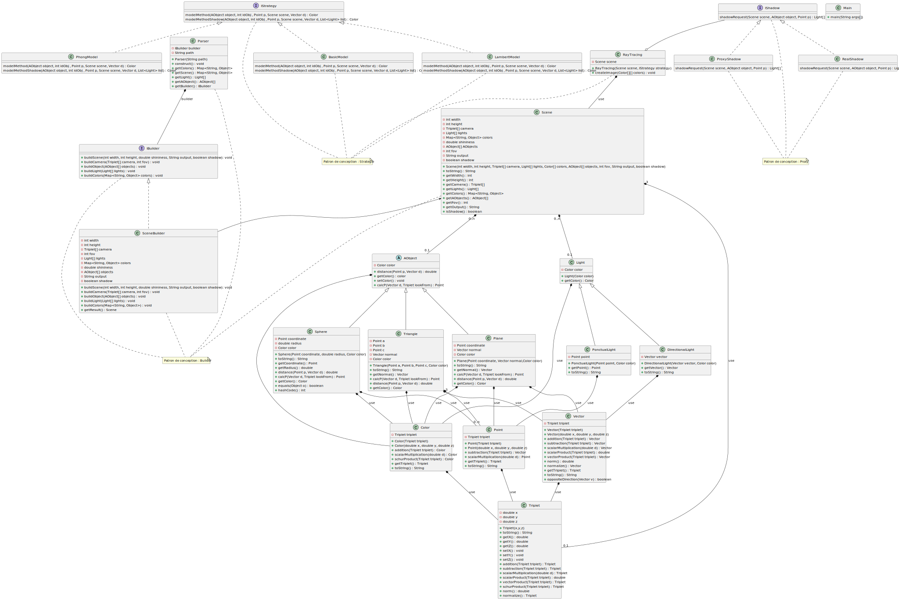

# Projet SAE S3.A.01 - RayTracing

<h1>Participants :</h1>

- @nicolas_blart 
- @leo_denis 
- @matheo_dupuis 
- @nicolas_nourry 

<h2> Diagramme de classe </h2>

Pour l'ouvrir et le visionner plus en détail, téléchargez l'image au format SVG, et zoomer aux endroits qui vous intéressent.

<h2> Lancement du projet </h2>

Pour lancer ce projet, l'explication se situe [ici](image/README.md) !

<h2> Détails du projet </h2>

Pour plus de détails concernant le projet, et la répartition des tâches, [cliquez ici](https://gitlab.univ-artois.fr/sae-01-groupe-n-3/raytracinglib/-/wikis/RayTracingLib) !
