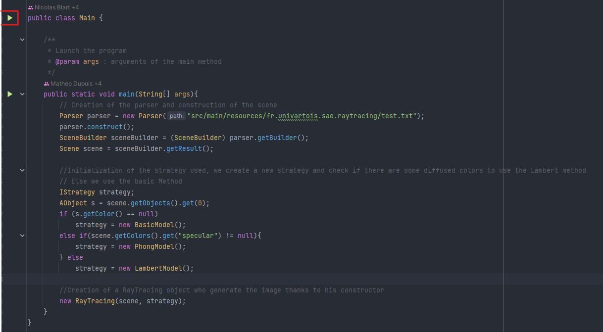

# Fichier Image

**Ce fichier contient les images créées par notre projet.**

### Comment l'utiliser?

Pour utiliser notre application vous devez éditer le fichier de configuration [``test.txt``](../src/main/resources/fr.univartois.sae.raytracing/test.txt) présent dans le répertoire [``src\main\resources\fr\univartois\sae\raytracing``](../src/main/resources/fr.univartois.sae.raytracing/)

Après le fichier de configuration modifié, vous devez lancer la classe Main, et votre image apparaitra dans ce répertoire.

